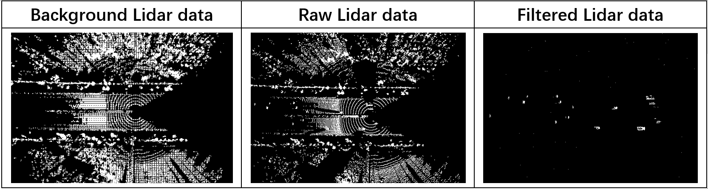

# An Efficient Background Filtering Method for Roadside LiDARs

This repository provides the official implementation of SVO-based background filtering from the following paper.

<section class="section" id="BibTeX">
  <div class="container is-max-desktop content">
    <h2 class="title">BibTeX</h2>
    <pre><code>@ARTICLE{10318073,
  author={Su, Zhongling and Cao, Peng and Liu, Xiaobo and Tang, Yandong and Chen, Fei},
  journal={IEEE Sensors Journal}, 
  title={An Efficient Background Filtering Method for Roadside LiDARs}, 
  year={2024},
  volume={24},
  number={14},
  pages={22056-22069},
  keywords={Laser radar;Filtering;Octrees;Point cloud compression;Three-dimensional displays;Roads;Real-time systems;Background filtering;light detection and ranging (LiDAR) data;ray casting;sparse voxel octree (SVO);traffic sensing},
  doi={10.1109/JSEN.2023.3331120}}
}</code></pre>
  </div>
</section>

Abstract:
In the context of connected and automated transportation systems (CATSs), light detection and ranging (LiDAR) is increasingly being deployed on the roadside to detect detailed motions of road users (i.e., vehicles and pedestrians) for real-time applications. To provide real-time detection, it is essential to conduct background filtering of the LiDAR point cloud to eliminate LiDAR points irrelevant to the traffic objects. Background filtering can significantly reduce the computational load of implementing a traffic-detection algorithm. However, existing methods are not sufficiently fast and accurate for real-time applications. This study proposes an efficient method of background filtering method for roadside LiDAR data by solving the problems of existing methods in the background filtering procedure. In the proposed method, the octree is used to aggregate LiDAR frames, which can dramatically reduce storage space compared to simply superposing frames in existing studies. Second, by integrating ray casting and occupancy ratio (RCOR), the background can be extracted according to the spatial relations and statistical probabilities of objects. In the final stage, a sparse voxel octree (SVO) is applied to represent the background, and a GPU-based parallel filtering algorithm can expedite background filtering significantly. We conducted a field experiment to collect LiDAR data using various LiDARs installed at the roadside of a freeway segment in Chengdu, China. The results demonstrate that the proposed method performs best in terms of accuracy and computation speed in a comparison experiment. Its performance can remain robust with various types of LiDARs under various traffic conditions.

## Requirements
### Hardware Requirements
- CUDA-ready GPU with Compute Capability 7.0+
### Software Requirements
- Conda (recommended for easy setup)
- C++ Compiler for PyTorch extensions
- CUDA SDK 11 for PyTorch extensions (we used 11.8)
- C++ Compiler and CUDA SDK must be compatible

## Cloning the Repository
```
git clone git@github.com:sukoncon/An-Efficient-Background-Filtering-Method-for-Roadside-LiDARs.git SVO_BG
cd SVO_BG
```

## Installation
### Local Setup

Our default, provided install method is based on Conda package and environment management:
```shell
conda env create --file environment.yml
conda activate SVOBG
```

### Install filter package
```
python setup.py install --user
```

## A simple case of background construction
We offer multiple frames detected by the 80-beam Lidar. Begin by extracting the files with the following command:
```
tar -xf raw_lidardata/81_lidar80.tar.xz 
```
Next, perform background extraction using:
```
python SVO_utils/BgExtract.py -s raw_lidardata/81_lidar80 -n 500 -o results
```
The output from the command line will tell you the location of the extracted background:
```
Background Pytorch file is saved to results/background.pt
Background PCD file is saved to results/background.pcd
BEV of background figure is saved to results/background.png
```
<details>
<summary><span style="font-weight: bold;">Command Line Arguments for BgExtract.py</span></summary>
  
  #### --source_path / -s
  Path of lidar data.
  #### --Tocc 
  Threshold of occupancy ratio, ```0.1``` by default.
  #### --num_frames / -n
  Number of frames to construct background.
  #### --sideLength
  Sidelength of the root voxel, ```128``` by default.
  #### --minSide
  Sidelength of the leave voxel, ```0.5``` by default.
  #### --output_path / -o
  Path of background lidar data.
</details>
<br>

## A simple case of filtering
We offer several frames of testing files. Begin by extracting the files with the following command:
```
unxz raw_lidardata/81_lidar80_ToFilter.tar.xz
tar -xvf raw_lidardata/81_lidar80_ToFilter.tar 
```
Upon executing the subsequent script, one may produce the filtered Point Cloud Data.
```
python SVO_utils/filtering.py -s raw_lidardata/81_lidar80_ToFilter -o results/filtered -b 81_lidar80_background.pcd
```
The output from the command line will tell you the location of the filtered background as well as the time to filter a frame:
```
filtered pcd is written to results/filtered/xxx.pcd
SVO filtering of the last frame used time: xxx ms
```
<details>
<summary><span style="font-weight: bold;">Command Line Arguments for filtering</span></summary>
  
  #### --source_path / -s
  Path of lidar data to be filtered.
  #### --background/ -b
  Path of background lidar data.
  #### --sideLength
  Sidelength of the root voxel, ```128``` by default.
  #### --minSide
  Sidelength of the leave voxel, ```0.5``` by default.
  #### --output_path / -o
  Path of filtered lidar data.
</details>
<br>

## Visualization


## Processing your own Scenes
Our background loaders expect the following dataset structure in the source path location:
```
<location>
|---raw_lidardata
|   |---<Lidar Folder1>
|   |---...
|   |---<Lidar FolderN>
        |---<lidar0.pt>
        |---<lidar1.pt>
        |---...
```
The "Lidar Folder" refers to either the lidar data you intend to use for background construction, or the raw lidar data you wish to filter and get pure vehicles.

## Explanation
1. The sideLength origin and minside of the SVO should be of the same with that you use in background extraction
